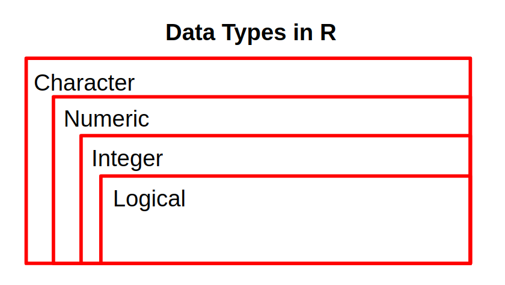

<style>
body {
text-align: justify}
</style>

```{r setup, include=FALSE}
# clear-up the environment
rm(list = ls())

# chunk options
knitr::opts_chunk$set(
  message = FALSE,
  warning = FALSE,
  fig.align = "center",
  comment = "#>"
)
```

# RStudio

**R** is the programming language, **RStudio** is an IDE for using R.
  
```{r import photo}
knitr::include_graphics("img/rstudio.png")
```

* **Console** : command prompt, engine utama  
* **Source**: *R Files*: RScript, RMarkdown
* **Environment tab**: Where we can save our R Objects
* **Files, Plots, Help tabs**:  
 - *Help*: to get help, use `?` followed by function name. e/g: `?class`

# Basic R Programming

## Introduction to R Markdown

Bagian putih dari R Markdown (.Rmd) berguna untuk menulis narasi. Pada bagian ini dapat ditambahkan heading dengan menambahkan hashtag `#` sebelum kalimat. Narasi yang tidak ditambahkan `#` sebelum kalimat akan menjadi paragraf biasa.

Bagian abu-abu dari Rmarkdown adalah `chunk`. Chunk berguna untuk menulis **code**. 

```{r}

```

## Object

Untuk pengolahan data di R, data atau sebuah value dapat disimpan/diassign ke dalam objek. Untuk assign objek dapat menggunakan `<-` dan hasilnya akan tersimpan pada environment.

```{r}

```

## R is Case Sensitive

```{r}

```


## Comment 

Untuk memasukan narasi dalam chunk dapat menggunakan **comment** dengan menambahkan `#` sebelum narasi tersebut. Comment tidak dianggap sebagai codingan dalam chunk, sehingga tidak akan menimbulkan error.

```{r}

```

## Overwrite

```{r}

```

## Data Type

### Character

Tipe data yang berisi huruf/karakter.

```{r}
# buat data 

# cek tipe data

```

Fungsi:
- class() untuk cek tipe data sebuah object

## 🏄 Dive Deeper

Buatlah 3 buah object sebagai berikut:

- `nama`: nama lengkap Anda
- `pekerjaan`: pekerjaan Anda saat ini
- `kota`: domisili Anda

Gunakan komentar untuk memperjelas code yang diketikkan

```{r}
# code here

```


### Numeric

Tipe data berisi angka yang dapat berupa angka kontinu (ada koma/pecahan), maupun diskrit (bilangan bulat tanpa koma).

```{r}


```

### Integer

Tipe data berisi angka yang berupa angka diskrit (bilangan bulat tanpa koma). Umumnya dari data ID (costumer ID, transaction ID, dll). Untuk memaksa numeric menjadi integer, dapat gunakan L dibelakang angka.


```{r}


```

### Logical

Tipe data yang hanya berisi `TRUE` atau `FALSE`. Penulisan TRUE/FALSE dapat disingkat menjadi T/F.

```{r}

```

Notes:
Tipe data di R (diurutkan dari yang paling general ke spesifik):
  
- Character: huruf, diapit dengan tanda kutip dua "..." ataupun kutip satu '...'
- Numeric: angka, bilangan desimal (berkoma, TIDAK diapit dengan kutip)
- Integer: angka diskrit, bilangan bulat, diikuti dengan L
- Logical: TRUE (T) atau FALSE (F)

## Data Structure

Struktur data merupakan bagaimana data disusun berdasarkan struktur tertentu, pada R terdapat 4 struktur data dasar yaitu vector, matrix, list, dan dataframe.

### Vector

Vector merupakan salah satu struktur data yang sering digunakan. vector merupakan struktur data yang hanya bisa menampung 1 tipe data saja dan hanya terdiri dari satu dimensi. untuk membuat vector dapat menggunanakan fungsi `c()`

```{r}
items <- c("Algoritma", "Lembaga Administrasi Negara", "Hackaton")
items
```

#### Implicit Coercion

Lalu, apa yang akan terjadi jika dalam satu vector memiliki beberapa tipe data yang berbeda seperti chunk dibawah ini?

```{r}
mix <- c("Algoritma", 2020, TRUE)
mix
```

Bila Anda perhatikan setiap nilai pada vector `mix` memiliki **petik dua**, artinya nilai tersebut merupakan sebuah objek dengan tipe character. Proses perubahan paksa tipe data dari suatu vector bisa disebut sebagai **implicit coercion**. Pada proses ini, tipe datanya otomatis akan berubah menjadi yang paling general pada nilai-nilai di dalam vector tersebut. Berikut urutan tipe data dari paling general ke yang paling spesifik:

```{r}

```

Notes:
- c() untuk menyimpan beberapa nilai sekaligus ke dalam sebuah vector
- () -> function
- [] -> akses nilai di dalam sebuah struktur data


## ❓ Knowledge Check

1. Dibawah ini mana pernyataan yang *salah* terkait sifat pemrograman di R ?     
- [ ] Bahasa Pemrograman R bersifat case sensitive     
- [ ] Tanda <- berfungsi untuk memasukkan suatu nilai kedalam sebuah objek     
- [ ] Tanda // diawal sebuah chunk berfungsi sebagai tanda komentar  
- [ ] tanda == digunakan untuk mengecek kesamaan antar 2 buah nilai

2. Tipe data yang tepat untuk kolom yang berisi *nama pelanggan* adalah ?
- [ ] Logical 
- [ ] Integer
- [ ] Character
- [ ] Numeric

3. Tipe data dari beberapa vector dibawah ini secara berurutan adalah?
- c(TRUE, 1L, 1/2) : 
- c("1", 12, 33.3) : 
- c(1,2,3,4L)      : 
 

### Factor

factor merupkan bentuk perkembangan dari vector, yang membedakan vector dan factor adalah pada factor objek memiliki levels. 

```{r}
card <- factor(c("Blue", "Gold", "Platinum", "Gold", "Gold"))
card
```
Factor: kita bisa mengetahui jumlah nilai unik pada data tersebut

### Matrix

Matrix merupakan struktur data yang memiliki 2 dimensi dan hanya bisa di isi dengan 1 tipe data saja
```{r}
mat <- matrix(11:16, nrow = 3, ncol = 2)
mat
``` 

Berikut ini cara untuk mengakses nilai di dalam sebuah matrix, gunakan kurung siku dan beri info index baris dan kolom dipisahkan dengan koma.
```{r}

```

### List

List merupakan struktur data yang dapat menyimpan lebih dari 1 tipe data dan hanya memiliki 1 dimensi

```{r}
our_list <- list(c(TRUE, FALSE), "TRUE", c(1, 6, 12), 1L)
our_list
```

Seperti `vector`, sebuah `list` hanya memiliki 1 dimensi; namun jika Anda ingin mengakses elemen-elemen data di dalamnya, Anda dapat menggunakan `[]`. Meskipun kita sudah menggunakan `[]`, kita masih akan mendapatkan objek dengan struktur data berupa `list`:

Jika ingin mengakses element pada list bisa mengguanakan tanda `[]`
```{r}
our_list[3]
```

Untuk mengakses _vector_ yang ada di dalamnya, maka kita bisa menggunakan `[[]]`:

```{r}
our_list[[3]]
```


### Data Frame

Data frame merupakan tipe data yang paling sering digunakan dalam pengolahan data, karena data frame dapat berisi beberapa tipe data serta memiliki 2 dimensi. Adapun cara untuk membuat sebuah data frame kita bisa menggunakan fungsi `data.frame()` seperti di bawah ini:

```{r}
daftar_buah <- data.frame(
  buah = c("Apel", "Semangka", "Jambu"),
  ukuran = c(22,76, 12)
)

daftar_buah
```

Ilustrasi dari rangkuman keempat struktur data yang sudah kita bahas di atas, dapat diilustrasikan seperti di bawah ini:

```{r}
knitr::include_graphics("img/structure.png")
```


## 🏄 Dive Deeper

Buat sebuah data frame yang berisi 3 baris dengan kolom sebagai berikut:

- `product_name`: nama produk di pasar swalayan (bebas/yang sering Anda beli)
- `quantity`: jumlah pembelian masing-masing produk 
- `harga`: harga satuan untuk masing-masing produk

Simpan pada object yang bernama `product`

```{r}
# code here

```

# Working with Data Frame

## Directory

untuk mengetahui lokasi directory dari lokasi Rmd bisa menggunakan fungsi `getwd()`

```{r}
getwd()
```

## Read and extracting data

untuk memasukkan data yang bertipe csv ke R kita bisa menggunakan fungsi `read.csv`. Pada workshop kali ini data yang digunakan adalah data *jobs_gender.csv* yang berada pada folder **data_input**

```{r}
workers <- read.csv(file = "data_input/jobs_updated.csv")
```

### View()
Pada umumnya ketika bekerja dengan data kita ingin melihat data bentuk data secara keseluruhan, hal tersebut dapat dilakukan dengan menggunakan fungsi `View()`.

```{r}

```

### head() and tail()

Untuk melihat seluruh sebagian data yang sudah digunakan bisa menggunakan fungsi `head()` dan `tail()`. 
`head()` berguna untuk melihat beberapa baris pertama pada data (default 6)
```{r}


```

sedangkan `tail()` untuk melihat beberapa data terakhir.

```{r}


```

### dim(), nrow(), ncol()

mengetahui dimensi dari data bisa menggunakan fungsi dim()

```{r}

```

untuk mengetahui jumlah baris bisa menggunakan fungsi `nrow()` sedangkan jumlah kolom bisa menggunakan `ncol()`
```{r}


```

### str()

Untuk melihat struktur data yang dimiliki dapat mengguankan fungsi `str()`

```{r}

```

### summary

dengan menggunakan fungsi summary() kita bisa melihat rangkuman dari suatu data.

```{r}


```

## ❓ Knowledge Check

1. Code yang tepat untuk melihat 10 baris terakhir pada data retail yaitu ?
- [ ] head(workers, 10)
- [ ] str(workers)
- [ ] summary(workers,10)
- [ ] tail(workers,10)

2. fungsi yang digunakan untuk menampilakan dimensi data serta tipe data setiap kolom secara sekaligus yaitu ?
- [ ] dim()
- [ ] ncol()
- [ ] class()
- [ ] str()


## Performing simple data cleansing

### Explicit Coercion

Tahapan awal sebelum melakukan analisis data adalah memastikan bahwa data yang digunakan sudah bersih. Salah satu teknik data cleansing yaitu mengubah tipe data dalam dataframe ke dalam tipe data yang tepat, atau dikenal sebagai istilah **explicit coercion**.

Jenis-jenis tipe data pada sebuah dataframe yaitu:
- chr: character, data berupa kata/kalimat
- int: integer, data bilangan bulat
- num: numeric, data bilangan real
- Date: date, data berisi informasi tanggal
- factor: data berisi informasi kategori, biasanya merupakan nilai yang berulang (contoh: tingkat pendidikan [SD, SMP, SMA])

Tipe data tersebut menyerupai tipe dan struktur data di R karena setiap kolom pada sebuah dataframe merupakan vector.

```{r}
# cek kembali struktur data workers
str(workers)
```

❓💬 **Diskusi:** Dari data `workers`, kolom manakah saja yang perlu diubah tipe datanya?

- ...
- ...
- ...

Untuk mengubah tipe data, kita bisa menggunakan fungsi `as.___()` di mana `___` diisi dengan tipe data tujuan. Contoh:

* `as.character()`
* `as.Date()`
* `as.integer()`
* `as.numeric()`
* dan sebagainya

```{r}
# explicit coercion


# sekarang pada kolom dengan tipe data factor muncul frekuensinya 

```

Parameter `format` pada `as.Date()` digunakan untuk menspesifikan format penulisan tanggal pada data, berikut format yang sering digunakan:

* YEAR
  - %Y = tahun empat digit, contoh: 2022
  - %y = tahun dua digit, contoh: 22

* MONTH
  - %B = nama bulan, contoh: January
  - %b = nama bulan singkatan, contoh: Jan
  - %m = bulan dua digit, contoh: 01

* DAY
  - %A = nama hari, contoh: Monday
  - %d = tanggal, contoh: 01 sampai 31
  
Untuk format lengkapnya dapat diakses pada [link ini](https://www.stat.berkeley.edu/~s133/dates.html).

```{r}

```

📌 Tambahan: Kolom dengan tipe data date dapat dioperasikan satu sama lain. Misal kita ingin menghitung durasi masa probation seseorang(`Order.Date`) dengan pengiriman (`Ship.Date`), lalu simpan hasil perhitungan ke kolom `Duration`.

```{r}
dummy <- data.frame(employee_id =c("8204031123", "8221051409", "8214071714"),
                    hiring_date = as.Date(c("2011-03-04", "2014-05-21", "2017-07-14")),
                    leave_date = as.Date(c("2016-07-12", "2015-09-20", "2021-04-10")))
dummy
```

Fungsi `difftime()` digunakan untuk menghitung `time1 - time2` dengan parameter:

- `time1`: waktu end
- `time2`: waktu start
- `units`: satuan waktu hasil pengurangan

```{r}
dummy$Duration <- difftime(
  time1 = dummy$leave_date,
  time2 = dummy$hiring_date,
  units = "days")
head(dummy)
```


### Subsetting

untuk melakukan subsetting pada R anda akan membutuhkan [,]. Ilustrasi penggunaan [,] dapat dilihat seperti gambar dibawah


```{r}
knitr::include_graphics("img/subset.png")
```

❓Dari data workers, ambil data dengan index 10 hingga 20

```{r}

```

❓ Dari data workers ambil kolom `occupation` dan `major_category`.

```{r}


```

#### Conditional Subsetting

Kita dapat menggunakan operator logikal berikut untuk melakukan **filter baris** berdasarkan kondisi tertentu.

**Logical Operator:** 

* `>` lebih dari
* `<` kurang dari
* `>=` lebih dari sama dengan
* `<=` kurang dari sama dengan
* `==` mengecek kesamaan 2 nilai
* `!=` tidak sama dengan
* `&` dan
* `|` atau

Contoh cara melakukan conditional subsetting:

❓ Dari data `workers` ambil data yang memiliki `total_earnings` lebih dari 60000, dan ambil kolom `occupation` dan `total_workers`.

```{r}

```

❓ Berapa banyak data yang memiliki `minor_category` Legal dengan persentase karyawan wanita (`percent_female`) diatas 50%?

```{r}

```

## 🏄 Dive Deeper

Sebagai seorang analis yang hendak mencari informasi tentang beberapa pekerjaan dari data yang dimiliki. Jawablah beberapa pertanyaan berikut!

1. Tampilkan seluruh data dengan nilai `total_earnings_female` lebih dari 100000 (100 ribu)!

```{r}
# your code

```

2. Berdasarkan data `workers` occupation mana saja dari `major_category` *Service* yang memiliki jumlah persentase pekerja wanita di bawah 3%?

```{r}
# your code

```

3. Tampilkan data workers yang memiliki `minor_category` yaitu Legal, Production, dan Transportation.

```{r}

```

---

### Check Missing Value

Untuk mengetahui apakah terdapat missing value pada data, kita bisa menggunakan fungsi `anyNA()`

```{r}

```

untuk mengecek missing value pada setiap kolom dapat menggunakan fungsi `is.na()` dan `ColSums()`

```{r}

```

[Additional Material]

Cara untuk membaca data kosong yang dituliskan dalam bentuk lain (-, spasi, dll)
```{r}
# read.csv(file="data_input/jobs_update.csv", na.strings = "-")
```

### Missing Values Imputation

Pada beberapa kondisi, kita dapat mengisi nilai missing pada data kita. Nilai missing ini dapat diisi tergantung kasusnya, bisa berupa perhitungan dari kolom lain, nilai tertentu, ataupun nilai tengah suatu data (mean atau median).

Cara paling sederhana untuk mengisi missing value adalah menggabungkan subsetting dengan kondisi `is.na()`. Setelah data berhasil disubset, assign nilai baru ke dalam data tersebut.

```{r}

```

## Data Aggregation 

Ketika melakukan analisis data selain subsetting hal lain yang sering dilakukan adalah aggregasi data. 

### `table()`

`table()`: menampilkan **frekuensi** tiap **kategori**

1. ❓Hitung frekuensi dari setiap `major_category` pada data.

```{r}

```

### `prop.table()`

Untuk mengetahui **proporsi/persentase** dari tiap kategori.

`prop.table(table(...))`

❓Tampilkan proporsi transaksi untuk masing-masing Segment pelanggan!

```{r}

```

### Xtabs

`xtabs()` menampilkan **jumlah (sum) suatu variabel numerik** untuk tiap variabel factor.

`xtabs(formula = ..., data =...)`

Ket:

* formula = numerik ~ factor
* data = data yang digunakan

Contoh:

❓Berapa jumlah total_earnings yang dihasilkan untuk tiap major_category?

```{r}

```

### Aggregate 

Untuk aggregasi data yang lebih fleksibel (dari segi fungsi yang digunakan), kita dapat menggunakan fungsi `aggregate()`. `aggregate()` digunakan untuk menghitung nilai statistik tertentu (jumlah, rata2, dll) berdasarkan kategori tertentu dalam data.

`aggregate(x=..., data=..., FUN=...)`

Keterangan:

* x = (yg ingin dihitung) ~ (kategori1) + (kategori2) + (dst)
* data = data yang ingin digunakan
* fungsi = nilai statistik tertentu:
    + sum   = jumlah
    + min   = nilai min
    + max   = nilai max
    + mean  = rata rata
    + median = nilai tengah
    + length = menghitung frekuensi

❓ Contoh: Berapa rata-rata total_earnings yang dihasilkan untuk tiap major_category?

```{r}

```

❓ Berapa jumlah minimal pekerja pria untuk setiap major_category?

```{r}

```

### 📝 Summary Tables

- `table()`: tabel frekuensi
- `prop.table()`: tabel proporsi/persentase
- `xtabs()`: tabel aggregasi dengan fungsi sum
- `aggregate()` tabel aggregasi dengan fungsi yang lebih fleksibel, outputnya berupa data.frame

## Sort Data by Values

Untuk mempermudah kita melakukan analisis data, kita dapat mengurutkan informasi pada data kita berdasarkan sebuah nilai. Hal ini dilakukan dengan menggunakan subsetting dengan kondisi menggunakan fungsi `order()`.

```{r}
dummy_2 <- data.frame(province = c("Aceh", "Riau", "Banten", "Bali", "Gorontalo", "Maluku"),
                      population = c(2619900, 3440000, 6381100, 2169300, 583800, 882200))
```

Menggunakan data dummy_2 di atas, kita akan mencoba mengurutkan provinsi dengan populasi tertinggi ke paling rendah.

```{r}

```

### 🏄 Dive Deeper

1. Berapa rata-rata pekerja perempuan yang bekerja di bidang `Community and Social Service` dan `Personal Care and Service`?

2. 3 pasangan `major_category` - `minor_category` yang yang menghasilkan rata-rata `total_earnings` tertinggi adalah?


